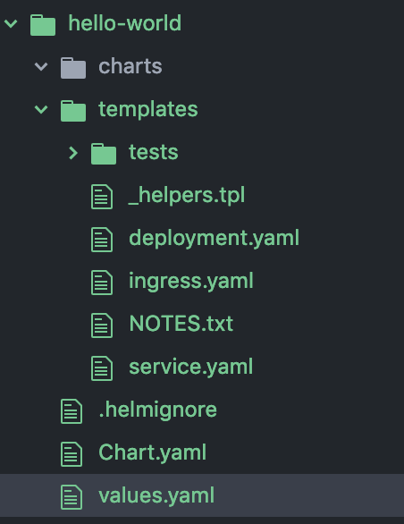
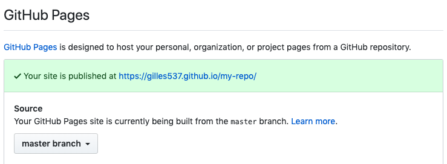

# Lab 16 - Helm

Helm helps you manage Kubernetes applications — Helm Charts help you define, install, and upgrade even the most complex Kubernetes application.

Charts are easy to create, version, share, and publish — so start using Helm and stop the copy-and-paste.

The latest version of Helm is maintained by the CNCF - in collaboration with Microsoft, Google, Bitnami and the Helm contributor community.

Helm is a tool for managing Kubernetes charts. Charts are packages of
pre-configured Kubernetes resources.

### Benefits of using helm

- Find and use [popular software packaged as Helm charts](https://github.com/helm/charts) to run in Kubernetes
- Share your own applications as Helm charts
- Create reproducible builds of your Kubernetes applications
- Intelligently manage your Kubernetes manifest files
- Manage releases of Helm packages

### Helm architecture

- Tiller Server: ***Helm manages Kubernetes application through a component called Tiller Server*** installed within a Kubernates cluster. Tiller interacts with the Kubernetes API server to install, upgrade, query and remove Kubernetes resources.
- Helm Client: ***Helm provides a command-line interface for users to work with Helm Charts***. Helm Client is responsible for interacting with the Tiller Server to perform various operations like install, upgrade and rollback charts.

### Components

- A ***chart*** is a collection of files organized in a specific directory structure
- The configuration information related to a chart is managed in the configuration
- Finally, a running instance of a chart with a specific config is called a ***release***

## Task 1: Install helm

If you're running kubeadm skip the minikube section and vice versa.

### Minikube

```
brew install kubernetes-helm
```

### Kubeadm

```
curl -L https://git.io/get_helm.sh | bash
```

## Task 2: Initialise Helm and install Tiller on the cluster

```
helm init --history-max 200
```

### Task 3: Installing an example chart

```
helm repo update
Update Complete. ⎈ Happy Helming!⎈

helm install stable/mysql
```

In the example above, the stable/mysql chart was released, and the name of our new release is wintering-rodent. You get a simple idea of the features of this MySQL chart by running helm inspect stable/mysql.

### Releases

It's easy to see what has been released using Helm:

```
helm ls
NAME          	REVISION	UPDATED                 	STATUS  	CHART      	APP VERSION	NAMESPACE
wobbly-leopard	1       	Tue Aug  6 14:44:03 2019	DEPLOYED	mysql-1.3.0	5.7.14     	default  
```

To uninstall a release, use the helm delete command:

```
helm delete wobbly-leopard
release "wobbly-leopard" deleted
```

### Task 4: Creating a chart

Let's quickly create a chart using the command

```
helm create hello-world
```

This will create the following directory structure for us:



Let’s understand the relevance of these files and folders created for us:

- Chart.yaml: This is the main file that contains the description of our chart
- values.yaml: this is the file that contains the default values for our chart
- templates: This is the directory where Kubernetes resources are defined as templates
- charts: This is an optional directory that may contain sub-charts
- .helmignore: This is where we can define patterns to ignore when packaging (similar in concept to .gitignore)

#### Task 5: Creating Template

Let’s edit the file deployment.yaml inside the templates directory to look like:

```
apiVersion: apps/v1
kind: Deployment
metadata:
  name: {{ include "hello-world.fullname" . }}
  labels:
    app.kubernetes.io/name: {{ include "hello-world.name" . }}
    helm.sh/chart: {{ include "hello-world.chart" . }}
    app.kubernetes.io/instance: {{ .Release.Name }}
    app.kubernetes.io/managed-by: {{ .Release.Service }}
spec:
  replicas: {{ .Values.replicaCount }}
  selector:
    matchLabels:
      app.kubernetes.io/name: {{ include "hello-world.name" . }}
      app.kubernetes.io/instance: {{ .Release.Name }}
  template:
    metadata:
      labels:
        app.kubernetes.io/name: {{ include "hello-world.name" . }}
        app.kubernetes.io/instance: {{ .Release.Name }}
    spec:
      containers:
        - name: {{ .Chart.Name }}
          image: "{{ .Values.image.repository }}:{{ .Values.image.tag }}"
          imagePullPolicy: {{ .Values.image.pullPolicy }}
          ports:
            - name: http
              containerPort: 8080
              protocol: TCP
```

Similarly, let’s edit the file service.yaml to look like:

```
apiVersion: v1
kind: Service
metadata:
  name: {{ include "hello-world.fullname" . }}
  labels:
    app.kubernetes.io/name: {{ include "hello-world.name" . }}
    helm.sh/chart: {{ include "hello-world.chart" . }}
    app.kubernetes.io/instance: {{ .Release.Name }}
    app.kubernetes.io/managed-by: {{ .Release.Service }}
spec:
  type: {{ .Values.service.type }}
  ports:
    - port: {{ .Values.service.port }}
      targetPort: http
      protocol: TCP
      name: http
  selector:
    app.kubernetes.io/name: {{ include "hello-world.name" . }}
    app.kubernetes.io/instance: {{ .Release.Name }}
```

Now, with our knowledge of Kubernetes, these template files look quite familiar except for some oddities. Note the liberal usage of text within double parentheses {{}}. This is what is called a template directive.

Helm makes use of the Go template language and extends that to something called Helm template language. During the evaluation, every file inside the template directory is submitted to the template rendering engine. This is where the template directive injects actual values in the templates.

#### Providing Values

In the previous sub-section, we saw how to use the template directive in our templates. Now, let’s understand how we can pass values to the template rendering engine. We typically pass values through Built-in Objects in Helm.

There are many such objects available in Helm, like Release, Values, Chart, and Files.

We can use the file values.yaml in our chart to pass values to the template rendering engine through the Built-in Object Values. Let’s modify the values.yaml to look like:

```
replicaCount: 1

image:
  repository: nginx
  tag: stable
  pullPolicy: IfNotPresent

nameOverride: ""
fullnameOverride: ""

service:
  type: ClusterIP
  port: 80

ingress:
  enabled: false
  annotations: {}
  hosts:
    - host: chart-example.local
      paths: []

  tls: []

resources: {}

nodeSelector: {}

tolerations: []

affinity: {}
```

## Understanding Helm Commands

### Task 6: Helm Lint

Firstly, this is a simple command that takes the path to a chart and runs a battery of tests to ensure that the chart is well-formed:

```
helm link ./hello-world
==> Linting ./hello-world/
[INFO] Chart.yaml: icon is recommended

1 chart(s) linted, no failures
```

### Task 7: Helm Template

Also, we have this command to render the template locally, without a Tiller Server, for quick feedback `helm template ./hello-world/`

### Task 8: Helm Install

Once we’ve verified the chart to be fine, finally, we can run this command to install the chart into the Kubernetes cluster:
```
helm install --name hello-world ./hello-world
NAME:   hello-world
LAST DEPLOYED: Mon Feb 25 15:29:59 2019
NAMESPACE: default
STATUS: DEPLOYED

RESOURCES:
==> v1/Service
NAME         TYPE      CLUSTER-IP     EXTERNAL-IP  PORT(S)       AGE
hello-world  NodePort  10.110.63.169  <none>       80:30439/TCP  1s

==> v1/Deployment
NAME         DESIRED  CURRENT  UP-TO-DATE  AVAILABLE  AGE
hello-world  1        0        0           0          1s

==> v1/Pod(related)
NAME                          READY  STATUS   RESTARTS  AGE
hello-world-7758b9cdf8-cs798  0/1    Pending  0         0s
```
### Task 9: Helm Get

Now, we would like to see which charts are installed as what release. This command lets us query the named releases:

```
helm ls -all
NAME          	REVISION	UPDATED                 	STATUS  	CHART            	APP VERSION	NAMESPACE
hello-world   	1       	Tue Aug  6 15:55:06 2019	DEPLOYED	hello-world-0.1.0	1.0        	default  
wobbly-leopard	1       	Tue Aug  6 14:44:03 2019	DELETED 	mysql-1.3.0      	5.7.14     	default
```

### Task 10: Helm Upgrade

What if we have modified our chart and need to install the updated version? This command helps us to upgrade a release to a specified or current version of the chart or configuration:

```
helm upgrade hello-world ./hello-world

Release "hello-world" has been upgraded. Happy Helming!
LAST DEPLOYED: Tue Aug  6 16:01:16 2019
NAMESPACE: default
STATUS: DEPLOYED

...
```
### Task 11: Helm Rollback

It can always happen that a release went wrong and needs to be taken back. This is the command to rollback a release to the previous version:

```
helm rollback hello-world 1
Rollback was a success! Happy Helming!
```

### Task 12: Helm Delete

Although less likely, we may want to delete a release completely. We can use this command to delete a release from Kubernetes:

```
helm delete --purge hello-world
release "hello-world" deleted
```

## Distributing Charts

All official helm charts can be found at: [their official repo](https://github.com/helm/charts). These can all be installed using the command `helm install stable/<chart>`. They are all open source and you can participate. If however you would like to create a private repository you will need to know the following concepts:

### Create a chart repository

A chart repository is an HTTP server that houses an index.yaml file and optionally some packaged charts. When you’re ready to share your charts, the preferred way to do so is by uploading them to a chart repository.

Because a chart repository can be any HTTP server that can serve YAML and tar files and can answer GET requests, you have a plethora of options when it comes down to hosting your own chart repository. For example, you can use a Google Cloud Storage (GCS) bucket, Amazon S3 bucket, Github Pages, or even create your own web server.

In this example we will show you how to host a chart repo on [github pages](https://github.com).

### Task 13: Helm Package

Firstly, we need to package the charts we have created to be able to distribute them. This is the command to create versioned archive files of the chart:

```
helm package ./hello-world/
Successfully packaged chart and saved it to: /lab-16/hello-world-0.1.0.tgz
mkdir hello-world/releases
mv lab-16/hello-world-0.1.0.tgz hello-world/releases
```

Note that it produces an archive on your machine that can be distributed manually or through public or private chart repositories.

### Helm Repo

Finally, we need a mechanism to work with shared repositories to collaborate. Repo bundles a bunch of commands that we can use to add, remove, list, or index chart repositories. Let’s see how we can use them.

We can create a git repository and use that to function as our chart repository. The only requirement is that it should have an index.yaml file.

#### Task 14: Create an index.yaml

We can create index.yaml for our chart repo:

```
helm repo index hello-world/ --url https://<username>.github.io/my-repo
```

#### Task 15: Create a github repository

Now we have to create our github repository. In my case i have made my repository (called my-repo) and pushed all my files to it. Afterwards I change the repository settings so that my master branch is published on github pages.



#### Task 16: Change index.yaml

Now I change my index.yaml file to look something like:

```
apiVersion: v1
entries:
  hello-world:
    - created: 2019-08-08T08:59:14.967429+02:00
      description: This is a basic hellow-world
      name: hello-world
      sources:
      - https://github.com/gilles537/my-repo/
      urls:
      - https://github.com/gilles537/my-repo/raw/master/releases/hello-world-0.1.0.tgz
      version: 0.1.0
generated: 2019-08-08T08:59:14.967429+02:00
```
Now I can surf to [https://gilles537.github.io/my-repo/index.yaml](https://gilles537.github.io/my-repo/index.yaml) And i will see my index.yaml files

#### Task 17: Adding our repo in helm

After successfully creating our repo we can add it in helm:

```
helm repo add my-repo https://my-pages.github.io/my-repo
"my-repo" has been added to your repositories

helm repo update
Hang tight while we grab the latest from your chart repositories...
...Successfully got an update from the "my-repo" chart repository
...
```

Now we have a repo in our helm CLI named my-repo which points to [https://gilles537.github.io/my-repo/index.yaml](https://gilles537.github.io/my-repo/index.yaml). Now we can install all of the charts listed in this index.yaml file.

#### Task 18: Installing our own charts via our repository

```
helm install my-repo/hello-world --name-hello-world

NAME:   hello-world
LAST DEPLOYED: Thu Aug  8 09:17:47 2019
NAMESPACE: default
STATUS: DEPLOYED

RESOURCES:
==> v1/Deployment
NAME         READY  UP-TO-DATE  AVAILABLE  AGE
hello-world  0/1    1           0          0s

==> v1/Pod(related)
NAME                          READY  STATUS             RESTARTS  AGE
hello-world-69b9ffd47c-l66xf  0/1    ContainerCreating  0         0s

==> v1/Service
NAME         TYPE       CLUSTER-IP      EXTERNAL-IP  PORT(S)  AGE
hello-world  ClusterIP  10.100.201.117  <none>       80/TCP   0s


NOTES:
1. Get the application URL by running these commands:
  export POD_NAME=$(kubectl get pods --namespace default -l "app.kubernetes.io/name=hello-world,app.kubernetes.io/instance=hello-world" -o jsonpath="{.items[0].metadata.name}")
  echo "Visit http://127.0.0.1:8080 to use your application"
  kubectl port-forward $POD_NAME 8080:80
```