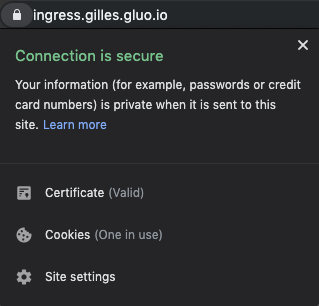

# Lab 20 - Ingress

## What is an ingress

Ingress exposes HTTP and HTTPS routes from outside the cluster to services within the cluster. Traffic routing is controlled by rules defined on the Ingress resource.

```
    internet
        |
   [ Ingress ]
   --|-----|--
   [ Services ]
```

Normally you would have to install an ingress controller to satisfy an ingress. Since our setup also works with cert-manager you would also need cert-manager issuer's. All info about this can be found here: [cert-manager](https://docs.cert-manager.io/en/latest/tutorials/acme/quick-start/).

Since all of this is already in place, we just need to add a service to expose and an ingress in front of it.

## Task 0: Creating a namespace

Create a namespace for this lab:

```
kubectl create ns lab-20

namespace "lab-20" created
```

## Task 1: Starting an example deployment and service

deployment.yaml:

```
apiVersion: extensions/v1beta1
kind: Deployment
metadata:
  name: kuard
spec:
  replicas: 1
  template:
    metadata:
      labels:
        app: kuard
    spec:
      containers:
      - image: gcr.io/kuar-demo/kuard-amd64:1
        imagePullPolicy: Always
        name: kuard
        ports:
        - containerPort: 8080
```

service.yaml:

```
apiVersion: v1
kind: Service
metadata:
  name: kuard
spec:
  ports:
  - port: 80
    targetPort: 8080
    protocol: TCP
  selector:
    app: kuard
```

Apply both files using the commands

```
kubectl apply -f deployment.yaml -n lab-20
kubectl apply -f service.yaml -n lab-20
```

## Task 2: Creating the ingress

ingress.yaml:

```
apiVersion: extensions/v1beta1
kind: Ingress
metadata:
  name: kuard
  annotations:
    kubernetes.io/ingress.class: "nginx"    
    certmanager.k8s.io/issuer: "letsencrypt-prod"

spec:
  tls:
  - hosts:
    - ingress.gilles.gluo.io
    secretName: quickstart-example-tls
  rules:
  - host: ingress.gilles.gluo.io
    http:
      paths:
      - path: /{your student number}
        backend:
          serviceName: kuard
          servicePort: 80
```
You will have to change the {your student number} with your actual student number.

apply this file with the command: `kubectl apply -f ingress.yaml -n lab-20`

## Task 3: Inspect the ingress

```
kubectl describe ingress kuard -n lab-20
Name:             kuard
Namespace:        default
Address:          104.199.47.96
Default backend:  default-http-backend:80 (10.4.0.4:8080)
TLS:
  quickstart-example-tls terminates ingress.gilles.gluo.io
Rules:
  Host                    Path  Backends
  ----                    ----  --------
  ingress.gilles.gluo.io  
                          /   kuard:80 (<none>)
Annotations:
  certmanager.k8s.io/issuer:                         letsencrypt-prod
  kubectl.kubernetes.io/last-applied-configuration:  {"apiVersion":"extensions/v1beta1","kind":"Ingress","metadata":{"annotations":{"certmanager.k8s.io/issuer":"letsencrypt-prod","kubernetes.io/ingress.class":"nginx"},"name":"kuard","namespace":"default"},"spec":{"rules":[{"host":"ingress.gilles.gluo.io","http":{"paths":[{"backend":{"serviceName":"kuard","servicePort":80},"path":"/"}]}}],"tls":[{"hosts":["ingress.gilles.gluo.io"],"secretName":"quickstart-example-tls"}]}}

  kubernetes.io/ingress.class:  nginx
Events:
  Type    Reason             Age                From                      Message
  ----    ------             ----               ----                      -------
  Normal  CREATE             39m                nginx-ingress-controller  Ingress default/kuard
  Normal  CreateCertificate  27m                cert-manager              Successfully created Certificate "quickstart-example-tls"
  Normal  UPDATE             20m (x3 over 39m)  nginx-ingress-controller  Ingress default/kuard
  Normal  UpdateCertificate  20m                cert-manager              Successfully updated Certificate "quickstart-example-tls"
  ```

As you can see the certificate is successfully updated and now should be able to serve our deployment via https to check this surf to [https://ingress.gilles.gluo.io](https://ingress.gilles.gluo.io)/{your student number}.

In the top left corner of your browser you should see that HTTPS is enabled and has a signed certificate:



## Task 4: Cleaning up

```
kubectl delete ns lab-20
namespace "lab-20" deleted
```
